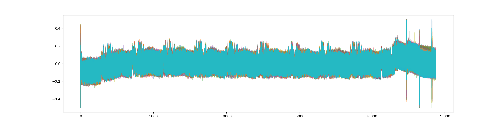
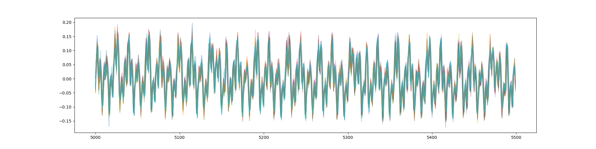

---
title: "Labo 1"
subtitle: "SFA 2023"
author: ["Mélissa Gehring", "Francesco Monti", "Maxim Golay"]
date: "26.04.2023"
toc: false
...

# Setup
We used three different components to capture our samples, as per the directions given. Namely, we connected a Chipwhisperer to our AES board to be able to capture traces during the AES encryption process. In-between was placed a USB-UART board to control the AES board from the Chipwhisperer. This also allowed us to automatically truncate traces to the duration of the AES encryption process, limiting the gathering of irrelevant data.

We took precisely 2000 traces, some of them using the same plaintext. There were problems with some of the traces though, namely that some of them were unusually noisy and impossible to exploit. We filtered out those traces by dropping the samples having a variance greater than a small threshold, say $0.01$.

# Some visuals
There is a visualisation of 5 complete traces:

And here is a visualisation of 500 samples of the same traces:

We can see that the traces differ a little bit and we will leverage that in conjunction with the law of large numbers to remove the noise and extract the key.

# Attack
The attack pattern we followed is the same as the one used for the `SCA-5` challenge. The relevant code can be found in [the attack notebook](src/attack.md). Here is an outline of the process:

- First, import the relevant matrices (traces, plaintexts and ciphertexts)
- Transpose the matrices of traces, plaintexts and ciphertexts
  - Pre-computing this step is fairly important for improving performance and allows us to easily iterate over the columns later
- Truncate the traces to an interesting range
  - We used the first 1500 data points of each traces, as this is where our graphs showed that the first AES round was occuring
- For all plaintext columns and all possible key bytes:
  - Create a guess vector $g$ for the current candidate key byte
  - Apply the model, which is $\text{HW}(g \oplus p)$, where $p$ is the current plaintext column and $\text{HW}$ the Hamming weight of each components of this vector
  - Compute all Pearson correlation coefficients between the vector of Hamming weights and all columns of traces
  - Keep the most promising candidate (the one having the biggest Pearson coefficient)
- Finally, export the key bytes as a byte string, revealing the flag `HEIG{k1ndaN0iSy}`

# Troubleshooting
Our traces were either not clean enough, not numerous enough or simply invalid, it we could not make our algorithm work with those. However, Robin's traces where pristine and worked wonders with only 300 samples.
