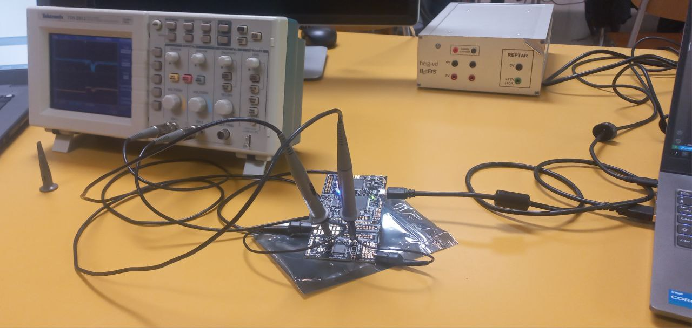
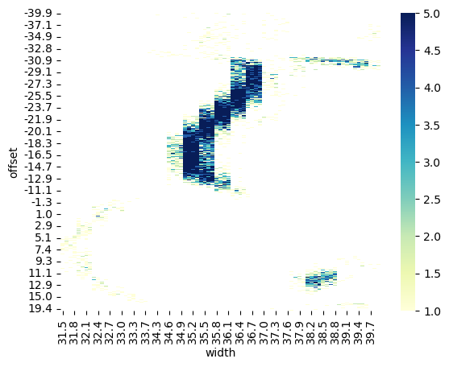
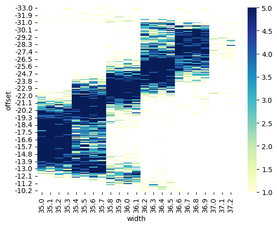
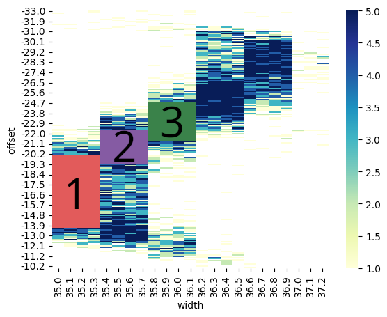
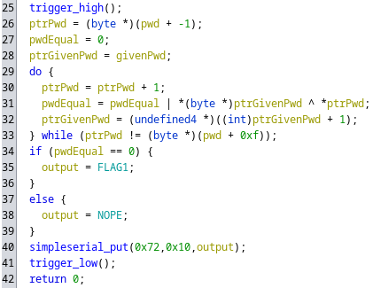
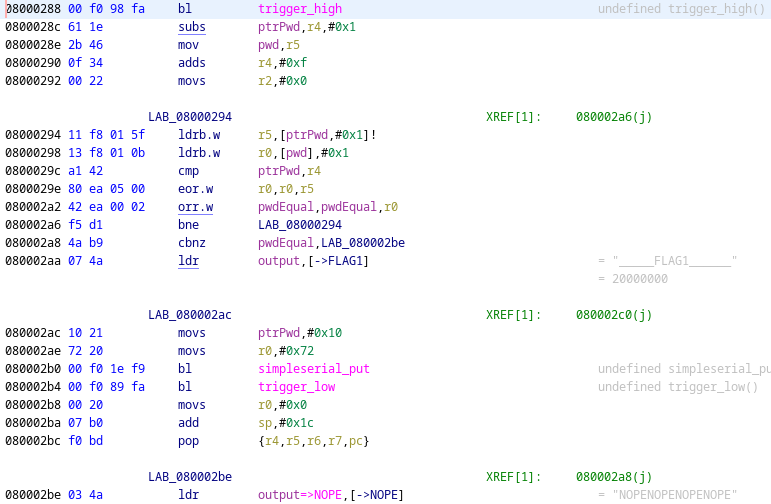
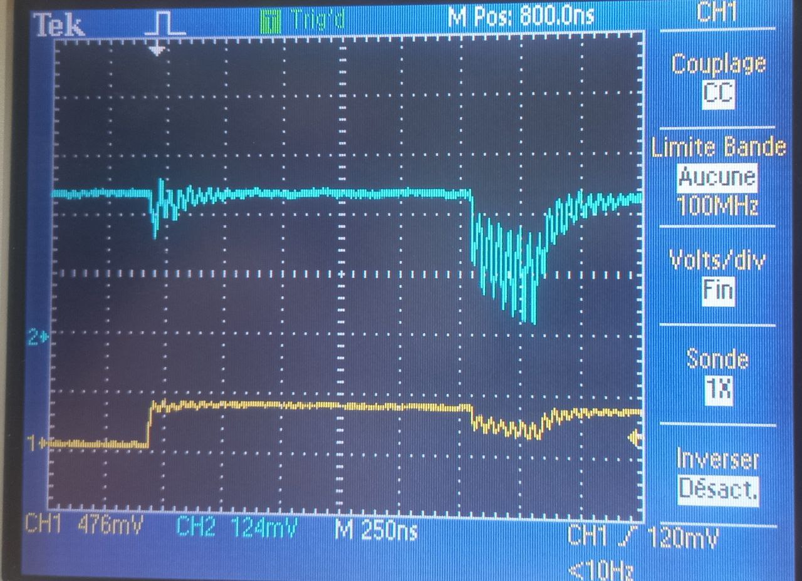
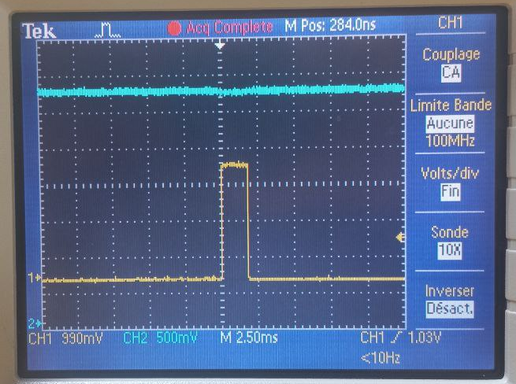
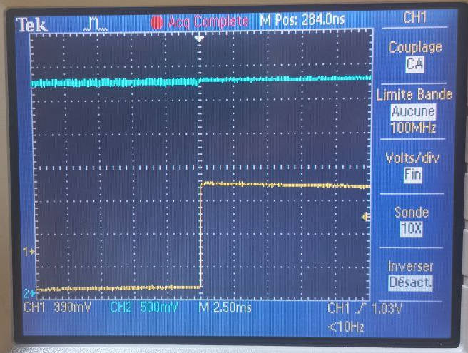

---
title: "Fault Injection"
subtitle: "Laboratory 2"
author: [Melissa Gehring, Maxim Golay, Francesco Monti]
date: 25.05.2023
toc: false
...

## Introduction

In this laboratory, we were able to experiment with fault injection on a board, by using voltage glitching on a counting function to find the best parameters, and then using those parameters to attack the password checking function of the program.

## Setup

To prepare for the laboratory, we first had to connect the board to the computer, as we can see on the Figure 1 below :


We also were given the opportunity to plug the board to an oscilloscope to measure the glitch in real time and have a way to visualise what was happening voltage-wise during a glitch.

Figure 2 shows the oscilloscope's setup :



We provide more details on the oscilloscope captures in the Attack section below.

Once everything was connected and ready to go, we started working on the notebook to perform the attack.

## Attack methodology

The attack was performed in two steps, which we describe below :

1. Characterization : use the glitch on a simple counting function to observe which parameters are the most promising. This is the part that took us the most time.

2. Attack the password checking function : use the parameters found in part 1 to attack the password checking function and get the flag.

### 1. Characterization

**Explanation**

To be able to know which parameters are the right ones, we first tried to glitch a simple function that counts up to 2500. We need the parameters that hit the _sweet spot_ of the chip, in order to find the best glitch success ratio. The counting function helps us finding that, because when the final count is different than 2500, we know that the board glitched and skipped at least one instruction. If the count is equal to 2500, then we can assume that those parameters weren't ideal and that the chip did not glitch. If the program does not return, then we can assume that the parameters caused the chip to crash.

The notebook that we were given contained a cell that allowed us to test multiple parameters in multiple loops, and to observe the final count output by the counting function. For each tuple of parameters, we tested the function 5 times to ensure we got consistant results. If the program glitched 5 times, we knew that that tuple of parameters was more promising than if the program glitched 0 or 1 time.

The parameters that we needed to test were `offset` and `width`.

-`offset` corresponds to the percentage into the clock cycle where the glitch starts. The smaller the value, the sooner in the cycle the glitch starts.

-`width`: corresponds to the percentage of the period to glitch. The smaller the value, the shorter the duration of the glitch.

Basically, we need to find the perfect combo between the starting time, and the duration of the glitch within the cycle.

**First run**

Now that we know how to define what it means for a parameter to be promising, it is time to tackle the the first step of the characterization part. The goal was to gather information on a wide, coarse range of parameters, to later be able to fine tune and pick a smaller, more precise range of parameters within the subrange that gave the best results on the first pass. 

For this we let the notebook run for a (very) long time, using those parameters :

| Parameter | Start value | End value | Step |
|-----------|-------------|-----------|------|
|  `offset` |     -40     |     20    |  0.2 |
|  `width`  |     31.5    |     40    |  0.1 |

Figure 3 shows the heatmap displaying the results of the first run :

{height=45%}

\pagebreak

We can see that we get nice results in the center of the graph, so we decided to concentrate our efforts on this part of the graph, as we can see on Figure 4.

{height=45%}


**Fine tuning**

We observed on the zoomed graph (Figure 4) that there were multiple zones were the amount of glitch hit was higher, almost always equal to 5/5. We decided to concentrate on 3 of these zones, shown on Figure 5.

{width=95%}

Zone 1

| Parameter | Start value | End value | Step |
|-----------|-------------|-----------|------|
|  `offset` |    -18.4    |   -13.9   |  0.1 |
|  `width`  |     35.0    |    35.3   |  0.1 |

Zone 2

| Parameter | Start value | End value | Step |
|-----------|-------------|-----------|------|
|  `offset` |    -23.8    |   -19.3   |  0.1 |
|  `width`  |     35.3    |    35.8   |  0.1 |

Zone 3

| Parameter | Start value | End value | Step |
|-----------|-------------|-----------|------|
|  `offset` |    -25.6    |   -21.1   |  0.1 |
|  `width`  |     35.7    |    36.2   |  0.1 |

To determine which zone was the most promising, we then reran the counting function, and observed the results of the final count.

**Best parameters**

The results of these 3 zones were pretty similar, but we decided to arbitrarily chose the zone 2, because after multiple rerun, it always seemed to give consistently good results.

The best parameters we chose for our attack are those of the second zone, namely :

| Parameter | Start value | End value | Step |
|-----------|-------------|-----------|------|
|  `offset` |    -23.8    |   -19.3   |  0.1 |
|  `width`  |     35.3    |    35.8   |  0.1 |

### 2. Attack

With the parameters found in step 1, we simply ran the attack cell that was given to us, and hoped for the best. We got the flag multiple times, with different `ext_offset` values.

Basically, now that we have a set of parameters that we know succeeds at a high ratio, we only have to find when in the program to apply the glitch. This is where `ext_offset` comes in handy. This parameter corresponds to the number of clock cycles to wait after the trigger. We know where in the cycle we need to apply the glitch, but we don't know what cycle (i.e. what instruction) will skip the password verification. We ran the attack cell with `ext_offset` between 1 and 30, and obtained the flag multiple times, when `ext_offset` was equal to 8, 15, 16 and 24.

**Flag**

`HEIG{RealFaulty}`

**Success rate**

We ran the attack cell 4 times, and got the flag 4 times with `ext_offset` being equal to 8 and 16, and 2 times with `ext_offset` being equal to 15 and 24. We can therefore say that the success rate is 100% for the first two values, and 50% for the last two values. We could (and should) have run the attack cell more times to get a more precise success rate, but we did not have the time to do so. After running the attack for a few (675) more times, we got a success rate of $98 \frac{2}{3}%$ which is pretty good.

**ext_offset values analysis**

In order to explain why the flag was retrieved with values 8, 15, 16 and 24, we analysed the binary of the program that was given to us.

On the Figure 6, we show the part of the firmware that interests us, namely the password function that is after the glitch trigger.

{width=95%}

and the corresponding assembly code on Figure 7.

{width=95%}

\pagebreak

We can see that 8 instructions after the trigger_high, we fall right on the `eorr.w` instruction, which corresponds to

```
pwdEqual = pwdEqual | *ptrGivenPwd ^ *ptrPwd;
```
which checks if the given password byte is equal to the actual password byte. Applying a glitch there bypasses the verification, and returns the correct value at the end of the program.

We do not explain further the reasons why it also works for the other values 15, 16 and 24, but the reasoning is similar.

**Power trace of a successful fault**

Figure 8 shows an example of the result we obtained on the oscilloscope when running the given notebook :

{width=95%}

In orange, we can observe the moment when the glitch is triggered, characterized by the change in voltage on the left of the trace. In blue, we can observe the delay between the glitch trigger and the moment when the glitch is applied, which is determined by one of the parameters `ext_offset`. The blue trace is the one that interests us, because it is the one that will be applied to the device. We can see the voltage dropping for some time, and then going back to its initial value. This is the glitch that is applied to the device. The voltage does not drop all the way to 0V, but lowers the voltage enough to cause a fault in the device.

{width=45%}
{width=45%}

In these two pictures we can see a normal execution (left) and a faulty execution (right). We can see that the faulty execution is way longer than the normal one, which is due to the code ether being stuck in an infinite loop, crashing or jumping the call to `trigger_low()`.

## (Bonus) second flag

We have to admit that we obtained the second flag randomly. When using the parameters made for the first flag and running the attack cell, the second flag also appeared after a while, and we aren't totally sure to understand how, or why it happened. We suppose that a well placed trigger jumps to a location in the code where the password is stored, or that maybe a condition skipped could crash the program and print the password, but we couldn't find the exact explanation in the provided source file. We also suppose that we lack the sufficient knowledge and tools to be able to provide a more detailed explanation on how we obtained the second flag.

**Flag**

`HEIG{GlitchR0xx}`

## Conclusion

To conclude, we can say that this lab helped us understand more about how to perform a fault attack, and the steps to follow to perform one, starting from the characterization of the fault, to the actual attack. We also deepened our understanding of the glitching process, and how to find the right parameters to perform a successful attack, as well as the importance of the timing of the glitch. Finally, analyzing the source code of the firmware helped us understand how the glitch could be used to bypass the password verification.