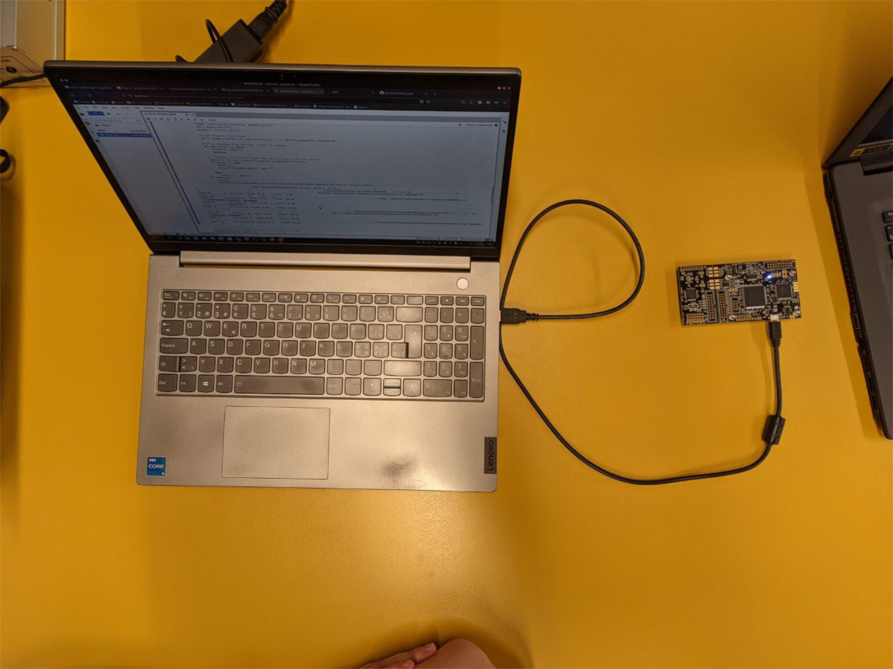
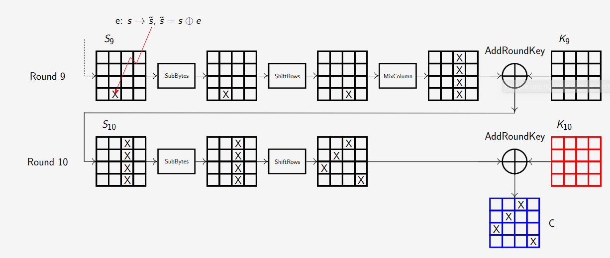
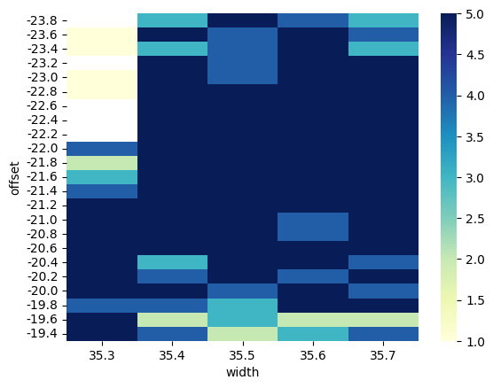
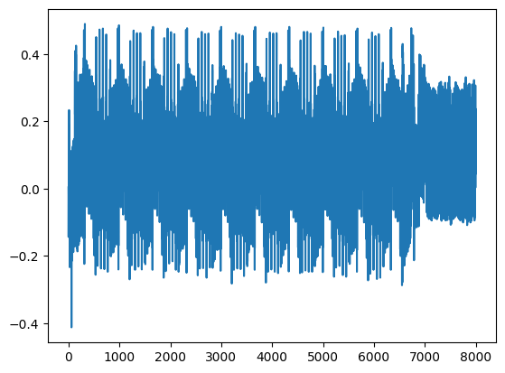

---
title: "AES 128 DFA on real target"
subtitle: "Laboratory 3"
author: [Melissa Gehring, Maxim Golay, Francesco Monti]
date: 08.06.2023
toc: false
...

# Introduction

In this laboratory, we were able to work on a real target, and perform a Differential Fault Analysis (DFA) on it. We were given a board with an AES algorithm implemented on it, and we had to find the key of the algorithm by injecting faults in the algorithm, and then analyzing faulty ciphertexts and using ones that followed a diagonal pattern. We were given a notebook to help us perform the attack, and we had to find the key of the algorithm, which was the flag.

## Setup

For this laboratory, we kept the same board as in the previous lab. In order to prepare for the AES attack, we only had to install the firmware on the board, and then follow the same procedure as in previous lab. We show our most impressive setup on the Figure 1 below :



Once everything was connected and ready to go, we started working on the notebook to perform the attack.

# Attack methodology

During the presentation of the lab, we were shown two ways of attacking the AES algorithm. The first consisted of attacking the 10th round of the algorithm, and the second consisted of attacking the 9th round. The first one was easier to understand, but required a **lot** of ciphertexts to be able to retrieve the key. The second one was more complicated to understand, but required less ciphertexts, and we could use a public python library, `phoenixAES`, to find the key directly from the diagonal faulty ciphertexts. 

To explain a bit further the concept of diagonal faulty, ciphertexts, we can look at the graph on Figure 2 below :



When a fault is applied on the 9th round, it is carried until the `MixColumn` operation, where the fault is then spread on the whole column and carried to the start of the 10th round. At the `ShiftRows` operation, the faulty column is then shifted, and the difference between the faulty ciphertext and the correct ciphertext is only on the diagonal. This is why we only need to find faulty ciphertexts that follow a diagonal pattern, so that we know that the fault was correctly applied.

## Characterization

We kept the same board as in the previous lab, so we already had good characterization parameters. We tried to run the couting loop again, with those parameters : 

| Parameter | Start value | End value | Step |
|-----------|-------------|-----------|------|
|  `offset` |    -23.8    |   -19.3   |  0.1 |
|  `width`  |     35.3    |    35.8   |  0.1 |

Without surprise, we got satisfying results as we can see on the Figure 3 below :

{width=80%}

In order to reduce the execution time, we decided to narrow down our parameter set even more (following the results we got in Figure 3), and kept the following parameters : 

| Parameter | Start value | End value | Step |
|-----------|-------------|-----------|------|
|  `offset` |    -23.0    |   -22.0   |  0.2 |
|  `width`  |     35.4    |    35.8   |  0.2 |

To compensate with the smaller parameter set, we increased the number of tries we executed for each parameter tuple from 5 to 7. 

We also had to determine when in the AES algorithm to inject the fault, which was characterized by the `ext_offset` parameter. We knew we had to apply the glitch on the 9th round, and following the graph seen in Figure 4 (given in the notebook) : 



We eyeballed that the 9th round was occuring between 5500 and 6500. To be sure we injected the fault at the right time, we decided to begin injecting at 5700.

## Relevant faulted ciphertexts

Once we had our parameters fixed, we let the notebook run for a while, and made sure to save the faulty ciphertexts that followed a diagonal pattern in a `numpy` array. Following the documentation on the `phoenixAES` plugin, we knew we had to find at least 22 faulty ciphertexts. Here is the snippet of code we used to save the faulty ciphertexts :

```py
[...]
val = target.simpleserial_read_witherrors('r', 16, glitch_timeout=10, timeout=30)
if val['valid'] is False:
    print("X", end="")
    continue

result = val['payload']
if result != CLEAN_CIPHERTEXT:
    xor = bytes(a ^ b for (a, b) in zip(CLEAN_CIPHERTEXT, result))
    print()
    print(f"ext_offset {ext_offset:02d}\tWidth {width:0.2f}\tOffset {offset:0.2f}\tResult {result.hex()}\txor: {xor.hex()}")
    # check if xor is diagonal
    if xor.count(b'\x00') == 12 and xor not in found_xor:
        found_xor = np.append(found_xor, xor)
        found_fciphers = np.append(found_fciphers, result)
        print("Found xor", xor.hex())
[...]
```

We stopped the execution of the notebook once we reached the 22 faulty ciphertexts. We ended up getting around 1700 diagonal faulty ciphertexts, but we got the same ones multiple times, with only 22 unique values. Once we had the 22 faulty ciphertexts, we could move on to the next step, which was to simply run the `phoenixAES` plugin with the code given below, and it gave us the key directly.

```py
with open('tracefile', 'wb') as t:
    t.write("""
30313233343536373839616263646566 cd8fe4faee3eb0cebf2d4feb3dfa2ecb
30313233343536373839616263646566 198fe4faee3eb0f4bf2d95eb3db02ecb
30313233343536373839616263646566 d08fe4faee3eb035bf2df1eb3d362ecb
30313233343536373839616263646566 d88fe4faee3eb053bf2d41eb3dcd2ecb
30313233343536373839616263646566 738fe4faee3eb0babf2dd5eb3d342ecb
30313233343536373839616263646566 cd4ae4fabf3eb0cebf2d4fb53dfafacb
30313233343536373839616263646566 cddde4fa523eb0cebf2d4f4e3dfaf9cb
30313233343536373839616263646566 cd44e4fadf3eb0cebf2d4f363dfa10cb
30313233343536373839616263646566 cd1de4fa103eb0cebf2d4fbd3dfa0bcb
30313233343536373839616263646566 cd8f68faeeb4b0ce9d2d4feb3dfa2e25
30313233343536373839616263646566 cd8f95faee35b0ce3c2d4feb3dfa2ec5
30313233343536373839616263646566 cd8fa9faee27b0ce8d2d4feb3dfa2e5c
30313233343536373839616263646566 cd8f2efaeecab0ce312d4feb3dfa2ec5
30313233343536373839616263646566 cd8fe43bee3e67cebfdf4feb72fa2ecb
30313233343536373839616263646566 cd8fe426ee3e87cebfe94feb53fa2ecb
30313233343536373839616263646566 a88fe4faee3eb07abf2db7eb3dbe2ecb
30313233343536373839616263646566 cc8fe4faee3eb073bf2dc9eb3d652ecb
30313233343536373839616263646566 598fe4faee3eb005bf2d75eb3d952ecb
30313233343536373839616263646566 cd3ce4faf13eb0cebf2d4f2c3dfa12cb
30313233343536373839616263646566 cd56e4fa6b3eb0cebf2d4fa33dfa32cb
30313233343536373839616263646566 cdece4fa963eb0cebf2d4f1c3dfa8dcb
30313233343536373839616263646566 cd8f07faee00b0cedc2d4feb3dfa2e45
30313233343536373839616263646566 cd8f0efaee81b0ce542d4feb3dfa2e18
""".encode('utf8'))

phoenixAES.crack_file('tracefile')
```

Note : the value on the left column is the password used, and the value on the right column is the faulty ciphertext, except for the first line, which is the correct expected ciphertext.

## AES Key

The `phoenixAES` plugin gave us the following key for the 10th round:\newline `969559CD3BD154F69F4EB2DC08359A64`, and finally we applied the inverse_key_expansion and converted it to ASCII to get the flag :

`HEIG{RealAES128}`

# Conclusion

To conclude, we can say that that lab helped us understand more about the concept of Differential Fault Analysis and about the DFA. It was really fun to observe that by applying a perfectly timed glitch, we could recover so much information.